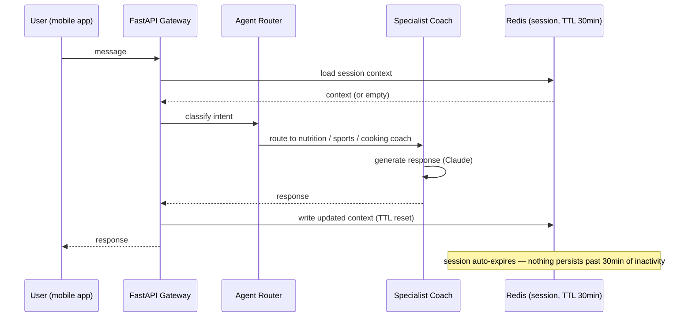

# AI Nutrition Coach — Stateless Multi-Agent Backend

A privacy-first conversational AI backend that routes users to specialized coaching agents (nutrition, sports, cooking) without persisting personal data beyond a short-lived session window.

Built as the AI layer for a multi-tenant nutrition-coaching SaaS platform — this repo is a sanitized extract of the architecture and design decisions, not the production source.

## The problem

Nutrition coaching conversations are personal — health data, meal logs, body metrics. Most chatbot backends default to storing full conversation history indefinitely "for context." That's a liability, not a feature: every stored message is data you now have to secure, audit, and eventually justify retaining.

The brief was a coaching API that feels continuous to the user across a session, but structurally cannot become a long-term PII store.

## Architecture

**Key decision — stateless by construction, not by policy.** There's no `users_history` table an engineer could accidentally query, no backup job that has to remember to exclude conversation data. The 30-minute Redis TTL is the only place conversation state exists at all. If a user comes back after the window closes, the system starts clean — the product tradeoff was decided deliberately in favor of privacy over infinite memory.

**Multi-agent routing.** Rather than one large system prompt trying to be a nutritionist, a trainer, and a chef, an intent classifier routes each turn to a specialist agent. This keeps each agent's prompt focused and makes it possible to add a new coaching domain without touching the others.

## Tech stack

| Layer | Choice | Why |
|---|---|---|
| API | FastAPI (Python 3.13) | async-first, typed, fast to iterate |
| LLM | Claude (Anthropic) | multi-agent tool use, long-context coaching conversations |
| Session store | Redis, TTL-based | enforces statelessness structurally, not by convention |
| Auth | Firebase Auth (tenant-scoped) | integrates with the multi-tenant frontend's existing identity layer |
| Deployment | Docker | environment parity across dev/staging/prod |

## Design decisions (ADRs)

This project used lightweight Architecture Decision Records to keep the "why" attached to the code instead of living only in someone's head:

- **Ephemeral sessions in Redis** — chosen over a database with a cleanup cron, because TTL expiry is enforced by the store itself, not by a job that can fail silently.
- **Stateless service architecture** — no server-side conversation persistence beyond the session TTL; the client owns long-term history if it wants it.
- **Tenant-validated access control** — every request is scoped to a tenant ID derived from the auth token, not passed as client input.

## What's in this repo vs. what's not

This is a **case-study extract**: architecture docs, decision records, and representative code patterns (agent routing, session lifecycle). It intentionally omits the production `app/` source tree, real infrastructure config, and any client-specific coaching content — those stay in the private repo this was built for.
