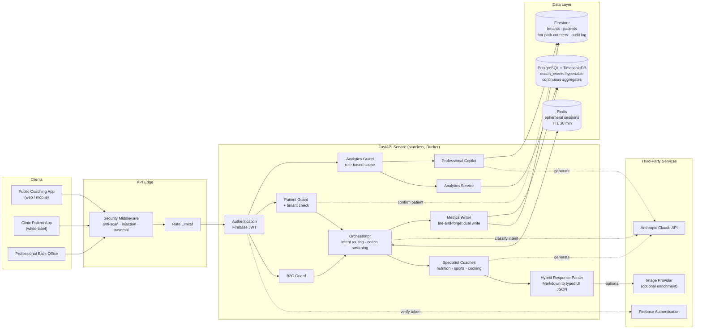
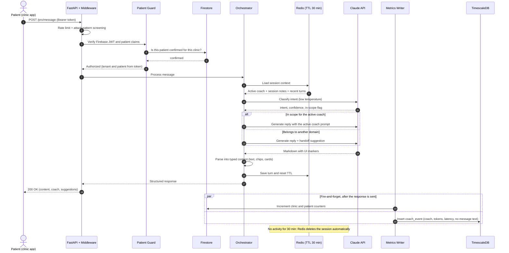

# Zymsia AI Coach — Privacy-First Multi-Agent Coaching Platform

> An AI coach that talks like a nutritionist, a trainer and a chef, then forgets the conversation. Health chats live in a 30-minute session and are never stored, yet clinics can still see exactly how their patients use it.

| | |
|---|---|
| **Role** | Product & Program Lead: product definition, architecture decisions, program governance and QA, with Claude Code as the execution team ([Idea to Launch method](https://github.com/eugeniozamora/idea-to-launch)) |
| **Tech Stack** | Python 3.13 · FastAPI · Anthropic Claude · Redis · Firebase Auth & Firestore · PostgreSQL + TimescaleDB · Docker · GitHub Actions |
| **Target Platform** | REST API serving a public mobile/web app (B2C), a clinic-branded patient app (B2B2C), and a professional back-office (B2B) |
| **Status / Impact** | Deployed to separate production and staging environments · 400+ commits since June 2025 · one API designed to serve three products |

---

## Business Problem & Solution Overview

### The Challenge

Nutrition coaching is one of the most personal conversations a user can have with software: body weight, eating habits, medical conditions, training routines. The product brief had three requirements that pull against each other:

1. **Feel like a real coach.** Answers must stay consistent within a session, feel expert, and cover the whole topic (what to eat, how to train, how to cook it). A generic chatbot can't do that.
2. **Don't become a health-data liability.** Most chatbot backends keep every message forever "for context". Each stored message then has to be secured, audited, justified under GDPR and deleted on request.
3. **Serve three businesses from one backend.** Consumers use a public app. Clinics give the coach to their patients under the clinic's own brand. Nutritionists need analytics on how their patients use it. Each audience has different access rules, and data must never leak between clinics.

### The Solution

A **stateless, multi-agent AI API** where privacy is enforced by how the system is built, not by a written policy:

- **Conversation state exists in only one place: a Redis session that deletes itself after 30 minutes of inactivity.** There is no conversation history table that an engineer could accidentally query or a backup job could accidentally copy. The client app owns long-term history if the user wants it.
- **An intent router sends each message to a specialist agent**, each with its own focused prompt. This avoids one huge prompt that tries to be a dietitian, a trainer and a chef at once.
- **Analytics are split from conversations.** Clinics get usage metrics (volumes, token cost, latency, engagement) from a separate time-series store that records *that* a coaching turn happened, never *what was said*. Raw events are deleted automatically after 90 days, and a patient's data can be hard-deleted on request.
- **Every audience gets its own authorization rule** on top of one shared authentication layer. The data a caller can see is derived from the signed token, never from parameters the client sends.

---

## Key Features & Capabilities

**Conversational AI**
- **Three specialist coaches.** Nutrition, sports and cooking agents, each with its own versioned system prompt and scope.
- **Hybrid coach switching.** If a question stays within the active coach's domain, the coach simply answers it. If it belongs to another domain (e.g. a recipe question sent to the sports coach), the system *suggests* a handoff and the user decides. Users can also pick a coach directly from a menu, which skips the classifier.
- **LLM-based intent classification.** A low-temperature Claude call returns the intent, a confidence score and whether the message is in scope. It falls back to a safe default if the model is unavailable. Every classification is logged as training data for a future lightweight classifier.
- **Session memory without retention.** Rolling AI-generated session notes keep long conversations coherent within the session window without storing a full transcript.
- **Structured UI from natural language.** Claude writes normal Markdown with light markers (e.g. suggested quick-reply chips). A parser turns them into typed JSON the frontend renders as buttons and cards, with no brittle "reply in JSON" prompting.
- **Built-in localisation.** Spanish, English and Catalan for coach names, system messages and prompts, chosen from the user's locale.

**Multi-tenant clinic features (B2B2C / B2B)**
- **Patient access checks.** A patient must be confirmed by their clinic before they can use the coach. Pending or unknown patients get `403`.
- **AI copilot for professionals.** Nutritionists generate a personalised motivational closing message for a patient. Patient names are left out of the prompt to avoid sending PII, prompts are versioned, and every generation is written to an audit log attached to that patient.
- **Clinic analytics API.** Six read endpoints: conversation histograms, day × hour heatmap in the clinic's own timezone, token cost per coach, latency percentiles (p50/p95/p99), coach usage distribution, and monthly engagement hours. All of them support drill-down to a single patient.
- **GDPR hard-delete.** An admin-only cascade delete removes a patient's telemetry, called from the clinic platform's patient-offboarding flow.

**Operations**
- Rate limiting per endpoint, health checks that include dependencies, request-level security middleware, and automatic deploys to staging and production.

---

## System Architecture & System Design

### High-Level Architecture

**Reading the diagram:** every client goes through the same edge and the same authentication step. The request then takes one of three authorization paths, one per audience. Conversation state only ever passes through Redis. Firestore holds tenant identity, live counters and audit records. TimescaleDB holds content-free telemetry for analytics.

### Core Data Flow — A Clinic Patient Sends a Message

A failure in either analytics store never affects the patient's response or the other store. Telemetry is written after the response and isolated per store.

---

## Technical Stack & Decision Rationale

| Category | Technologies |
|---|---|
| **Client applications** | Separate repositories: public web/mobile app, white-label clinic patient app, professional back-office |
| **Backend / API** | Python 3.13, FastAPI (async), Pydantic v2 (schemas and typed settings), SlowAPI (rate limiting) |
| **AI / LLM** | Anthropic Claude (Haiku by default for speed and cost), versioned prompt modules per coach and per feature |
| **Identity & Access** | Firebase Authentication (JWT), signed custom role claims (`admin` / `professional` / `patient`) |
| **Session State** | Redis 7, TTL-based ephemeral keys |
| **Operational Data** | Cloud Firestore: tenants, patient status, live counters, audit log |
| **Analytics Storage** | PostgreSQL 16 + TimescaleDB (hypertables, continuous aggregates, retention policies), SQLAlchemy 2 async + asyncpg, Alembic migrations |
| **Quality** | Ruff (lint + format), pytest + pytest-asyncio, Codecov coverage, pre-commit hooks |
| **CI/CD & Hosting** | GitHub Actions (lint → test → coverage gates on every PR), Docker, automatic deploy to a VPS through a self-hosted runner (`develop` → staging, `main` → production) |

### Architectural Decisions

- **Ephemeral Redis sessions instead of a database with a cleanup job.** A cron job that purges old conversations can fail without anyone noticing. A Redis TTL is enforced by the store itself. This makes "we don't keep your conversations" a property of the system, not a promise, and it removes a whole class of GDPR retention and audit work.
- **Two telemetry stores (hot + cold) instead of one.** Firestore counters give the clinic dashboard instant numbers with no query cost. TimescaleDB stores one content-free row per coaching turn and pre-aggregates hourly, daily and monthly rollups, so analytics stay fast as volume grows. Built-in retention (raw events kept for 90 days) keeps storage bounded without custom code. Both writes happen after the response, so analytics can never slow down or break a coaching conversation.
- **Several focused agents instead of one large prompt.** Each coach has a small, testable prompt with a clear scope. Adding a new domain means adding a prompt and an intent mapping, without regression-testing the others. Classification uses a small, fast model at low temperature. Its output is logged so it can later be replaced by a cheaper purpose-trained classifier.
- **Authorization derived from the token, never from the client.** Clinic and patient identity always come from signed token claims, never from the request body, so changing an ID in a request can't expose another patient's data. A patient token must also match its clinic and patient pair exactly. For analytics, the role in the token decides what a caller can see. A professional's clinic is fixed by their identity. If they ask for another clinic's data they get an empty result, because the SQL filter excludes it; there is no error message that would reveal the data exists.

Each of these decisions is written up as an **Architecture Decision Record** (Redis ephemeral sessions, stateless architecture, tenant validation, token-plus-role analytics access, tooling consolidation). The reasoning stays attached to the code rather than living in one person's head.

---

## Engineering Highlights & Security Standards

### Patterns & Practices

- **Layered architecture.** API layer (routes, schemas, dependency injection) → service layer (orchestrator, coach manager, context manager, metrics writer) → persistence layer (Redis client, repositories, async database engine). Routes contain no business logic.
- **Repository pattern** for telemetry writes and deletes, so the analytics store can be swapped or mocked in tests.
- **Dependency-injected authorization guards.** Three explicit guards (B2C, patient, analytics) share one authentication step. Each endpoint declares exactly one guard, so it is always clear who may call it.
- **Orchestrator / strategy pattern** for multi-agent routing: manual selection → handoff confirmation → classification → scope check → answer or suggest.
- **Typed configuration.** All settings are validated at startup through Pydantic Settings, and optional subsystems (e.g. the analytics store) degrade to a no-op when they are not configured.
- **Shared domain vocabulary.** A living glossary defines terms like *conversation* vs *event* vs *message*, so metrics mean the same thing in the backend, the clinic dashboard and conversations with stakeholders.
- **Schema migrations as code.** The time-series schema, rollups and retention policies are versioned and reversible through Alembic.
- **Test strategy.** Fast unit tests with mocked AI and infrastructure run on every PR, and Docker-based integration tests run against real Firebase and Postgres. CI blocks merges on lint or test failures.
- **Work tracking.** Epics → user stories → squash-merged PRs, with one clean commit per story that closes its issue automatically.

### Security Standards

- **Authentication on every protected endpoint** via verified Firebase JWTs. Roles come from signed custom claims, not from the request body.
- **Tenant isolation.** Clinic and patient IDs are read only from signed token claims, and patient access is checked against the clinic's records before any AI call. A clinic's analytics scope is fixed by its identity token.
- **Defensive edge middleware.** Detects and blocks path traversal, SQL/command-injection patterns and scans for sensitive files (`.env`, `.git`, common admin paths). Commonly scanned paths like `/metrics` are deliberately kept as tripwires, which is why the real analytics API lives at a different path.
- **Rate limiting** on every AI-backed endpoint, which also caps cost exposure to the LLM provider.
- **Data minimisation by design.** Conversations expire automatically. Telemetry records metadata only (coach, tokens, latency, time), never message content. Copilot prompts leave out patient names. Every AI generation in the professional tool is audit-logged.
- **Right to erasure.** An admin-only endpoint deletes all of a patient's analytics data, wired into the clinic platform's patient-deletion flow.
- **Secret hygiene.** Credentials are injected at runtime through environment configuration, never committed, and can be rotated without a redeploy.
- **LLM abstraction.** The rest of the codebase never talks to Claude directly. Model calls sit behind service modules with retry and fallback handling, so model versions, providers or prompt versions can change without touching API contracts.

---

## Why This Is in the Portfolio

The other projects here show product platforms, migrations and a consumer launch. This one shows what happens when "add AI" has to work under real constraints: sensitive health data, GDPR, several clinics sharing one system, and a real API bill. Privacy is built into the architecture instead of promised in a policy. Every AI turn is measured for cost and latency. One API is designed to serve three products without data leaking between clinics.

---

## Portfolio & Intellectual Property Notice

This repository is an **architectural case study**. It documents the system design, engineering decisions and delivery standards behind a deployed AI coaching platform. The production source code, prompts, infrastructure configuration and all credentials remain in private repositories under intellectual-property and confidentiality obligations, and are not included here.

I'm happy to walk through the architecture, trade-offs and implementation in more depth on a technical call.

**[Book a meeting](https://calendar.app.google/5FeUeC4X1VBYt2bU6)** · [eugeniozamora.com](https://eugeniozamora.com) · [LinkedIn](https://www.linkedin.com/in/eugeniozamora/) · [GitHub](https://github.com/eugeniozamora)
